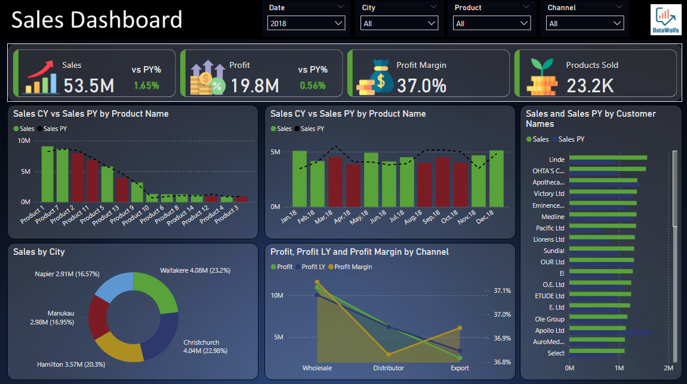
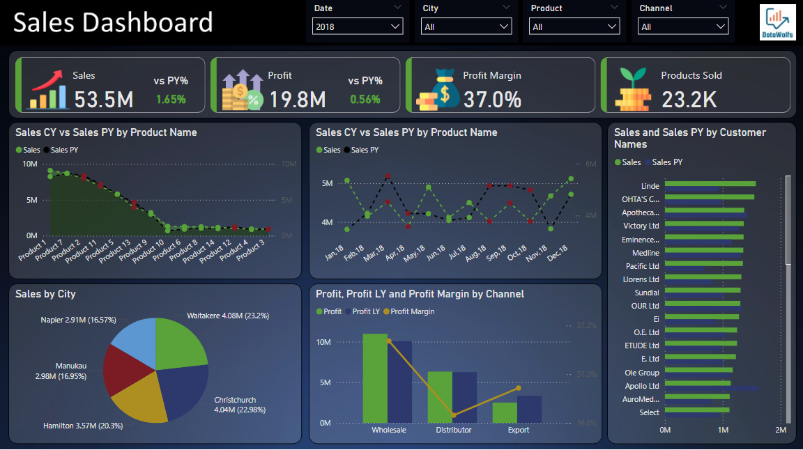

# Sales and Retail Analytics Dashboard

##  Client: XYZ Corporation  (Dummy)
**Industry:** Retail / E-commerce  
**Data Analyst:** Liaqat Ali Shaiz

---

##  Business Problem Statement

XYZ Corporation is a mid-sized retail company operating across multiple regions with a diverse product portfolio. While sales channels include Wholesale, Distributor, and Export, the company has been facing fluctuations in sales and profitability. However, the leadership team lacks clarity on the root causes due to missing insights around customer behavior, product performance, and regional trends.

---

##  Business Objectives

1. **Performance Overview** – Evaluate overall sales and profit from January 2017 onward.
2. **Trend Analysis** – Identify monthly and quarterly trends to locate peak and off-peak sales periods.
3. **Product Performance** – Pinpoint high-performing and underperforming products.
4. **Channel Effectiveness** – Compare sales and profitability across Wholesale, Distributor, and Export.
5. **Customer Insights** – Identify top customers and their purchasing behavior.
6. **Regional Analysis** – Highlight top-performing regions and cities.
7. **Profitability** – Calculate profit margins to optimize pricing and cost structures.
8. **Year-over-Year Comparison** – Assess growth or decline in key metrics over time.

---

##  Business Challenges

- No centralized dashboard for real-time monitoring.
- Limited visibility into product/channel-specific performance.
- Decision-making delays due to fragmented or outdated reports.

---

##  Dataset Overview

**Sales Orders Data (Excel Format):**  
Includes the following fields:
- Order Number
- Order Date
- Customer Name Index
- Channel
- Currency
- Warehouse
- Delivery Region
- Product Description
- Order Quantity
- Unit Selling Price
- Unit Cost

---

##  Calculated Metrics

- **Total Sales** = `Unit Selling Price × Order Quantity`
- **Total Cost** = `Unit Cost × Order Quantity`
- **Profit** = `(Unit Selling Price - Unit Cost) × Order Quantity`
- **Profit Margin (%)** = `(Profit / Sales) × 100`

---

##  Power BI Dashboard Features

- **KPIs:** Total Sales, Total Profit, Orders, Profit Margin
- **Trend Analysis:** Monthly and Quarterly visuals
- **Product Performance:** Top/bottom performers by Sales and Profit
- **Channel Comparison:** Sales & Profit by Channel + Year-over-Year view
- **Geographical Insights:** Top 5 Cities by Sales and Profit
- **Customer Analysis:** Top customers and contribution to revenue
- **Dynamic Filtering:** By Date, City, Channel, Product

---

## Expected Deliverables

- Fully interactive Power BI dashboard
- Actionable insights and strategic recommendations
- Visual storytelling to support business decisions

---
# Dashboard - A

---
##  Dashboard A Insights

---

###  Key Performance Metrics

- **Total Sales:** $53.5 million (_1.65% increase vs prior year_)
- **Profit:** $19.8 million (_0.56% increase vs prior year_)
- **Profit Margin:** 37.0% (_Healthy margin indicating good cost control_)
- **Products Sold:** 23,200 units

---

###  Product Performance Analysis

- **Top Performers:** Product 1 is the strongest seller (_highest bar in the chart_)
- **Consistent Products:** Several products show similar performance YoY (_equal bar heights_)
- **Growth Opportunities:** Products with increased sales over prior year indicate effective strategies

---

###  Monthly Sales Trend

- **Seasonal Pattern:** Sales peak around **April–May** and **October–November**
- **YoY Growth:** Most months show current year sales > prior year (_blue bars > orange_)
- **Weakest Month:** **January** shows the lowest sales in both years

---

###  Customer Analysis

- **Top Customers:** Linde, ORTA'S C..., and Apotheca... are top contributors
- **Customer Concentration:** Top 3–5 customers account for a large portion of sales
- **Growth Accounts:** Some customers show significant growth compared to the prior year

---

###  Geographic Distribution

- **Top Cities by Sales:**
  - Christchurch – **22.98%**
  - Waltakere – **22.92%**
- **Other Key Contributors:**
  - Merudau – **16.95%**
  - Napier – **16.57%**
- **Opportunity:** Expand in lesser-performing cities to reduce risk and drive growth

---

###  Channel Performance

- **Most Profitable:** **Wholesale** delivers the highest absolute profit
- **Healthy Margins:** All channels maintain margins between **36.8% – 37.1%**
- **Consistency:** Minimal fluctuations in YoY profit across channels

---

###  Recommendations

1. Analyze and replicate **Product 1's success strategy** across other product lines
2. Leverage **seasonal peaks** with focused marketing efforts
3. Enhance **account management** for top customers to ensure loyalty and upsell
4. Identify and **expand in underpenetrated cities** to diversify revenue
5. Maintain profitability while exploring **operational efficiencies** in sales channels

---
# Dashboard - B

---
##  Dashboard B Insights

---

###  Key Performance Metrics _(Same as Dashboard A)_

- **Total Sales:** $53.5M (_1.65% YoY growth_)
- **Profit:** $19.8M (_0.56% YoY growth_)
- **Profit Margin:** 37.0% (_Stable and strong_)
- **Products Sold:** 23.2K units

---

###  Product Performance Deep Dive

- **Top Product Alert:** A product (possibly mislabeled as "probability") shows an unusually high profit margin of **1,462.5%**. This may indicate a **data error** or an **extreme outlier** (e.g., low-cost, high-margin).
- **Consistent Margins:** Most other products maintain margins between **0.41–0.46**, indicating stable pricing and cost structures.
- **Sales Growth:** Certain products show strong YoY growth (_e.g., $50.4M vs $40.4M_), while others are flat.

** Recommendations:**
- Investigate the **1,462.5% margin** product — may be a **key driver** or **reporting anomaly**.
- Replicate successful strategies from **high-growth products**.

---

###  Customer Sales Trends

- **Top Customers:** Linde, ORTAS C..., and Apotheca... continue to lead in sales.
- **Stable Relationships:** Many customers report **identical CY and PY sales** ($64.4M), showing loyalty and consistency.
- **Growth Potential:** Accounts like **Victory Ltd** and **Eminence...** show room to expand.

** Recommendations:**
- Focus on **upselling and retaining** top clients to prevent churn.
- Engage **mid-tier customers** (e.g., Medline, Pacific Ltd) for growth opportunities.

---

###  Geographic Sales Breakdown

- **Top Cities:**
  - Christchurch – **22.98%**
  - Waltakere – **23.25%**
- **New Key Market:** **Hamilton** appears with **20.35%**, suggesting strong potential.
- **Balanced Sales:** Napier (16.57%) and Manukau (16.95%) show solid contributions.

** Recommendations:**
- Investigate success drivers in **Hamilton** and consider scaling.
- Explore **underpenetrated cities** for new market entry.

---

###  Channel Profitability

- **Wholesale** remains the **most profitable** channel.
- **Distributor** and **Export** channels show stable, albeit lower, contributions.
- **Profit Margins:** All channels hover around **37%**, indicating efficiency.

** Recommendations:**
- Maintain current **channel strategies** while identifying possible **efficiency improvements** for Distributor & Export.

---

##  Contact

**📧 Email:** [Liaqat.Ali.Shaiz2@gmail.com](mailto:Liaqat.Ali.Shaiz2@gmail.com)  

---
